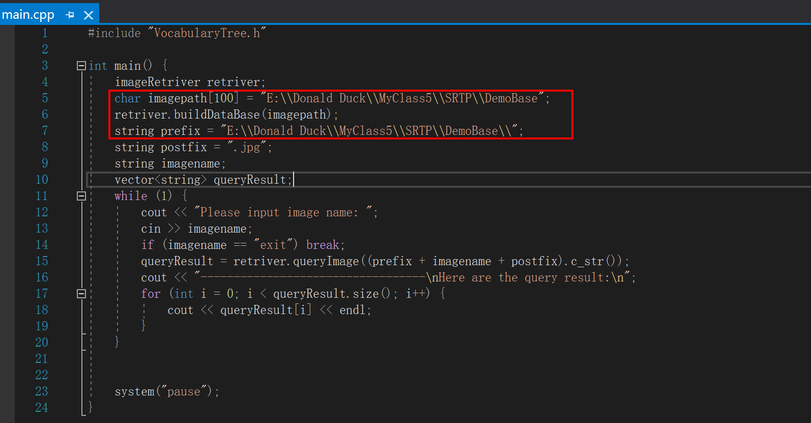

# VocabularyTree

/Demo3:

​	C++ 版本的初步尝试，主要用于深化对理论的认识，了解整个流程

​	运行时需要修改图片源集的路径

/src:

​	linux环境下python实现的最终版本，运行需要根据提示pip相对应的模块，在src同级目录下新建/imgs-compressed 文件夹放置图片源集，而后进入文件夹，执行make开始自动分类，同时保留词汇树文件；执行make redo还原分类前的结果

/paper:

​	课题项目论文
